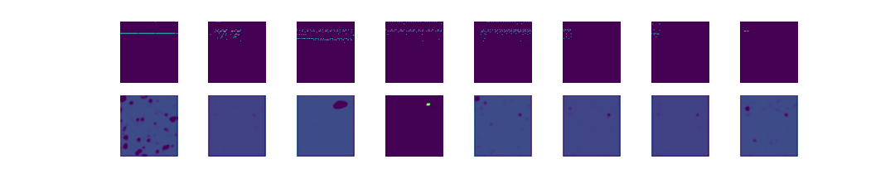
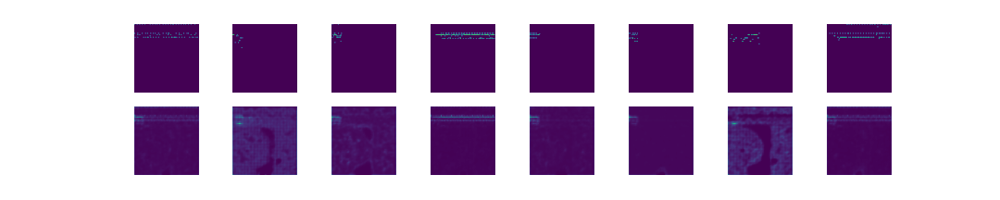

# midi2img_vae

A VAE trained on the image representation of midi files.

### Dataset
[groove-v1.0.0-midionly.zip](groove-v1.0.0-midionly.zip) from the
[Groove MIDI Dataset](https://magenta.tensorflow.org/datasets/groove)

### Data Preprocessing
* `data_preprocessing.py`: converts midi to images using [https://github.com/mathigatti/midi2img](https://github.com/mathigatti/midi2img).

* `train.py`: train the vae

* `analysis.py`: run analysis on trained model

### Status
I am still exploring this idea. Feel free to clone this repo and contribute if you like it.
I am sharing a model and some exaples in the `generations/` folder.

#### Credits
The code is mostly based on the [VAE series](https://www.youtube.com/watch?v=Ey8IZQl_lKs&list=PL-wATfeyAMNpEyENTc-tVH5tfLGKtSWPp) by [Valerio Velardo](https://github.com/musikalkemist/generating-sound-with-neural-networks).
